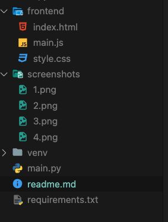
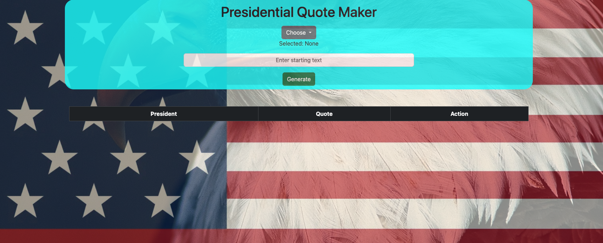
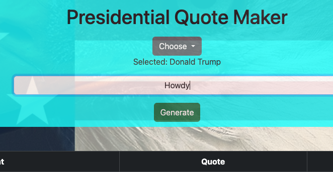
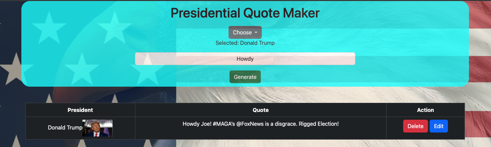
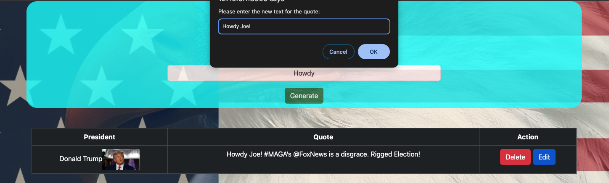

# Presidential Quote Maker

## Overview
The "Presidential Quote Maker" is a web application built using the FastAPI framework along with HTML, JavaScript, and CSS for the frontend. This application allows users to generate and manage quotes attributed to former U.S. Presidents Donald Trump and Joe Biden, using pre-trained language models. Users can create, view, update, and delete quotes, making it a full CRUD application.

## Features
- **Create Quotes:** Users can generate quotes by selecting a president and providing a prompt. It then saves the quote to the database.
- **Read Quotes:** All generated quotes are displayed in a table with the president's name, the quote, and an image of the selected president.
- **Update Quotes:** Users can edit the text of any quote. Changes are reflected in the DB.
- **Delete Quotes:** Any quote can be removed from the list. Changes are reflected in the DB.
- **NOTE:** *Line 32-72 in main.py contain all the CRUD api endpoints*

## File Structure
Here is the structure of the project files:

I tried to keep it simple but organized.

## Installation

### Prerequisites
- Python 3
- pip

### Setup
1. Clone the repository:
    ```
    git clone <repository-url>
    ```
2. Navigate to the project directory:
    ```
    cd presidential-quote-maker
    ```
3. Create a virtual environment:
    ```
    python -m venv venv
    ```
4. Activate the virtual environment:
    - On Windows:
        ```
        .\venv\Scripts\activate
        ```
    - On Unix or MacOS:
        ```
        source venv/bin/activate
        ```
5. Install the required dependencies:
    ```
    pip install -r requirements.txt
    ```

## Running the Application
1. Start the FastAPI server:
    ```
    uvicorn main:app --reload
    ```
2. Go to `http://localhost:8000` to use the application!

## Technologies Used
- **FastAPI:** For creating the backend API.
- **HTML/CSS/JavaScript:** For the frontend.
- **Transformers:** For generating quotes using pre-trained language models.

## Screenshots
*Homepage*


*Quote Generation*


*Quote Display*


*Editing quote*

## Future Enhancements
- Integrate more language models for a wider range of personalities.
- Make general api endpoint that handles all these language models.
- Provide social sharing options for generated quotes.
